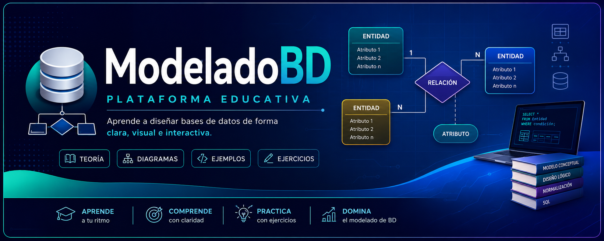
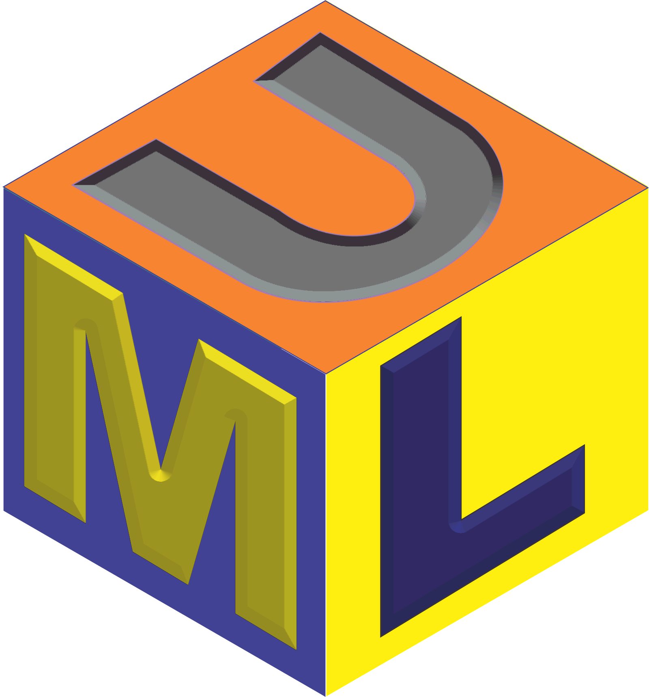
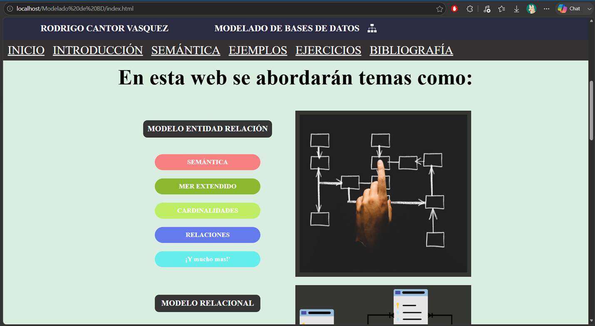

# ModeladoBD - Plataforma Educativa de Modelado de Bases de Datos 
    
<!--
<details>
<summary>Haz clic para ver más</summary>

🚀 **[Ver aplicación en vivo aquí](https://rcvunicun-lgtm.github.io/ModeladoBD/)**

</details>
-->

---

## 📖 Descripción

**ModeladoBD** es una plataforma web educativa desarrollada para facilitar el aprendizaje del **Modelado de Bases de Datos** mediante contenido teórico, diagramas explicativos, ejemplos prácticos y ejercicios interactivos.

El proyecto organiza los conceptos de forma progresiva, permitiendo que estudiantes y personas interesadas comprendan los fundamentos del diseño conceptual de bases de datos desde una interfaz moderna, intuitiva y completamente responsiva.

---

## 🖼️ Vista Previa



---

## ✨ Características principales

- 📚 Contenido organizado en módulos temáticos para un aprendizaje progresivo.
- 📖 Explicaciones teóricas acompañadas de diagramas e ilustraciones.
- 📝 Ejemplos prácticos que muestran la aplicación de cada concepto.
- 🎯 Ejercicios para reforzar los conocimientos adquiridos.
- 📱 Diseño totalmente responsivo compatible con computadores, tabletas y dispositivos móviles.
- 🎨 Interfaz limpia, moderna y orientada a mejorar la experiencia de aprendizaje.
- ⚡ Navegación sencilla desarrollada únicamente con tecnologías web nativas.

---

## 📂 Estructura del proyecto

```text
ModeladoBD/
│
├── Imagenes/                 # Recursos gráficos utilizados en el contenido
├── Iconos/                   # Iconografía del sitio
├── estilos/
│   └── estilo.css            # Hoja principal de estilos
├── javascript/
│   └── index.js              # Funcionalidades e interacción del sitio
│
├── index.html                # Página principal
├── introduccion.html         # Introducción al modelado
├── semantica.html            # Modelo semántico
├── formato.html              # Reglas y formatos
├── ejemplos.html             # Casos prácticos
├── ejercicios.html           # Actividades de aprendizaje
├── bibliografia.html         # Fuentes de consulta
│
└── README.md
```

---

## 💻 Tecnologías utilizadas

- HTML5
- CSS3
- JavaScript (ES6)
- Responsive Design
- Flexbox
- CSS Grid

---

## ⚙️ Requisitos

- Navegador web moderno
  - Google Chrome
  - Microsoft Edge
  - Mozilla Firefox
  - Safari

No requiere instalación de dependencias externas.

---

## 🚀 Instalación

### 1. Clonar el repositorio

```bash
git clone https://github.com/rcvunicun-lgtm/ModeladoBD.git
```

### 2. Abrir el proyecto

```text
ModeladoBD/
```

Abrir el archivo

```
index.html
```

o ejecutar mediante **Live Server** en Visual Studio Code.

---

## 📚 Contenido

La plataforma está organizada en diferentes módulos educativos:

- Introducción al Modelado de Bases de Datos.
- Conceptos fundamentales.
- Modelo Semántico.
- Reglas y formatos.
- Diagramas explicativos.
- Ejemplos prácticos.
- Ejercicios.
- Bibliografía.

---

## 🎯 Objetivos del proyecto

- Facilitar el aprendizaje del Modelado de Bases de Datos.
- Explicar conceptos complejos mediante recursos visuales.
- Centralizar teoría y práctica en una única plataforma.
- Ofrecer una herramienta de consulta para estudiantes.

---

## 🧠 Lo que aprendí desarrollando este proyecto

Durante el desarrollo de ModeladoBD fortalecí conocimientos en:

- Organización y estructuración de contenido educativo.
- Desarrollo Front-End utilizando HTML, CSS y JavaScript.
- Diseño de interfaces centradas en la experiencia del usuario (UI/UX).
- Diseño responsivo mediante CSS Grid y Flexbox.
- Organización modular de proyectos web.
- Optimización de recursos gráficos para aplicaciones educativas.
- Creación de experiencias de aprendizaje apoyadas en diagramas e ilustraciones.

---

## 📈 Mejoras futuras

- Agregar evaluaciones automáticas.
- Incorporar animaciones para explicar procesos de modelado.
- Añadir buscador de conceptos.
- Implementar modo oscuro/claro.
- Crear nuevas unidades temáticas sobre normalización y SQL.

---

## 👨‍💻 Autor

**Rodrigo Cantor Vasquez**

Ingeniero de Sistemas

GitHub:
https://github.com/rcvunicun-lgtm

---

## ⭐ Si este proyecto te resulta útil...

No olvides darle una ⭐ al repositorio.